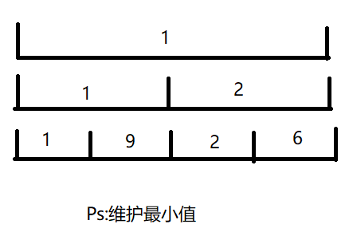

# day2 线段树, 树状数组

<!-- more -->

### 线段树
一个完全二叉树，其中的每一个节点都表示对一段区间维护的信息
信息要求可快速合并。

#### 数组法：
由于是完全二叉树，存储时可以让 1 为根，$i$的左右儿子为$2i$和$2i+1$.

#### 动态开点法
```cpp
struct node
{
    int l, r; // 表示两个儿子
    int val;  // 表示维护的信息（如和，最小值等）
};
```
画出来差不多是这个样子：



#### 支持操作
单点修改：修改一个数值后，容易发现至多影响 log n 个点的信息
```cpp
int tr[N * 4];
void change(int o, int pos, int val, int l, int r)
{
    if(l == r) tr[o] = val; // 找到这个点了
    int mid = l + r >> 1;
    if(pos <= mid) change(o * 2, pos, val, l, mid);
    else change(o * 2 + 1, pos, val, mid + 1, r);
}
```
区间查询 将区间拆分成极大的维护的区间（共$\theta (log n)$个), 再把这些信息合并
```cpp
int query(int o, int l, int r, int left, int right)
{
    if(l == r) return tr[o];
    int m = l + r >> 1;
    int ans = 0;
    if(left <= l && right >= mid) ans = query(o * 2, l, mid, left, right);
    if(left <= mid+1 && right >= r) ans += query(o * 2 + 1, mid + 1, r, left, right);
}
```
